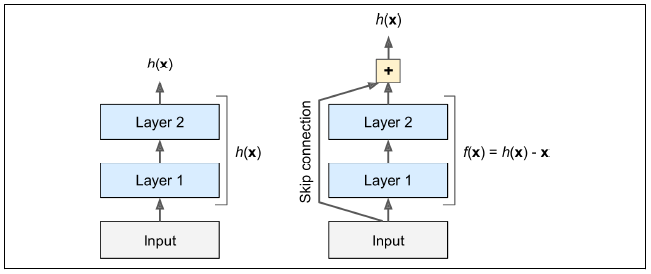
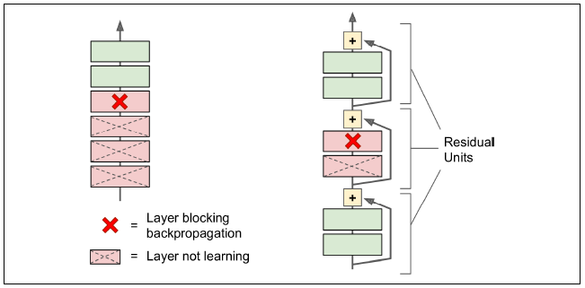
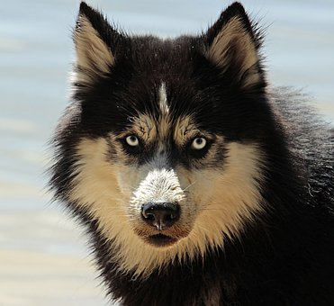

---
layout: post  
mathjax: true  
comments: true  
title: ResNet-50 API  
tags: [Computer Vision, Software Development]  
---  

Quick walkthrough of deploying the ResNet-50 Computer vision model via Flask, NGINX, Gunicorn, and Docker.  

The goal of this post is not to go in depth on each of the above mentioned technologies, but rather to illustrate the ease with which a model can be deployed with open-source tools.  

## ResNet-50  
ResNet-50 is a 50 layer convolutional neural network trained on more than 1 million images from the [ImageNet](http://www.image-net.org/) database. ImageNet is a commonly used data set in the computer vision world for benchmarking new model architectures. ResNet is short for *residual network*. The novel idea behind the architecture was the use of *skip connections* which represent the signal feeding into a layer is also added to the output of a layer higher up the stack. Below is a simple representation of this concept [1].  

  

The goal of training any neural network is to model some target function ($h(x)$ in the above image). By adding the input $x$ to the output of the network, you force the network to model $f(x)=h(x)-x$ rather than just $h(x)$ (i.e. the network is performing *residual learning*).  

Now why is this important or why did the developers of ResNet decide to do this? The answer lies with the speed with which we can train a convolutional neural network (CNN). CNNs are very computationaly expensive to train, and a training run of 1 million images with a 50 layer NN would presumable take a conisderable amount of time. Adding skip connections results in the network modeling the identity function (which is often fairly close to the target function), and this speeds up training considerably [1]. The network can also begin making progress even if several layers have not started learning yet (pictured below).  

  

Each residual unit in the network is composed of two convolutional layers without a pooling layer, Batch Normalization, ReLU activation, 3x3 kernels and a stride of 1. A grahpic of this architecture is shown below.  

  

Now that we've established a baseline for what a ResNet model is, we can move on to putting the pieces together for a simple API.  

## Basic API Architecture  
Our simple API is going to utilize the following components:  

1. Flask -> Lightweight WSGI web application framework.  
2. NGINX -> Web Server, Reverse Proxy, Load Balancer.  
3. Gunicorn -> Production-grade WSGI HTTP server.  
4. Docker -> Container, code isolation.  

The following image represents the basic architecture of how these components are connected.  

  

## Flask  
We'll start by constructing the app that will ingest our images, transform them to the appropriate format, and feed them to the ResNet model for inference. We first start by creating a basic function to prep the image that's received in the POST request.  

```python  
MODEL = ResNet50(weights="imagenet")


def prep_img(image, target):
    if image.mode != "RGB":
        image = image.convert("RGB")

    image = image.resize(target)
    image = img_to_array(image)
    image = np.expand_dims(image, axis=0)
    image = imagenet_utils.preprocess_input(image)
    return image
```  

We take in the image file, convert it to an array and resize it to the specifications that the model needs. The following step creates our basic **predict** route and designates it will accept **POST** requests. Our `predict` function takes in our image, runs the `prep_img` function on it, runs it against the model, then returns the predictions in **JSON** format.  

```python  
@app.route("/predict", methods=["POST"])
def predict():
    data = {"success": False}
    if flask.request.method == "POST":
        if flask.request.files.get("image"):
            image = flask.request.files["image"].read()
            image = Image.open(io.BytesIO(image))
            image = prep_img(image, target=(224, 224))
            preds = MODEL.predict(image)
            results = imagenet_utils.decode_predictions(preds)
            data["predictions"] = []
            for _, label, prob in results[0]:
                r = {"label": label, "probability": float(prob)}
                data["predictions"].append(r)

            data["success"] = True

    return flask.jsonify(data)

if __name__ == "__main__":
    app.run(debug=True, host="0.0.0.0")
```  

We designate the `host` as *0.0.0.0* to indicate the app will be running in a docker container. We now have the basics of our simple model endpoint, and we can setup the webserver and the http server.  

## Gunicorn  
We tell our app to utilize Gunicorn as the WSGI server through a simple python script `wsgi.py` and a shell script for starting the server.  

```python  
from .app import app

if __name__ == "__main__":
    app.run(use_reloaded=True, debug=True)  
```  

Below is the shell script to start the server.  

```bash  
#!/bin/sh

gunicorn -w 3 -b :5000 -t 30 --reload api.wsgi:app
```  

Our docker container for the app utilizes the shell script to start the app with Gunicorn as shown below.  

```dockerfile  
FROM python:3.7

RUN apt-get update

COPY ./requirements.txt /tmp/requirements.txt
WORKDIR /tmp
RUN pip3 install -r requirements.txt

COPY . /api
WORKDIR /
RUN chmod -x api/run_app.sh

CMD ["/bin/sh", "api/run_app.sh"]
```  

When our docker container starts, it will install all the necessary requirements for our app to run as well as start the app with the shell script.  

## NGINX  
We setup our reverse proxy / load balancer, NGINX, with some basic boilerplate in a `nginx.conf` file like so.  

```nginx  
worker_processes  3;

events { }

http {

  keepalive_timeout  360s;

  server {

      listen 8080;
      server_name api;
      charset utf-8;

      location / {
          proxy_pass http://api:5000;
          proxy_set_header Host $host;
          proxy_set_header X-Real-IP $remote_addr;
          proxy_set_header X-Forwarded-For $proxy_add_x_forwarded_for;
      }
  }
}
```  

Our NGINX dockerfile just copies this config and removes the default one that comes with the `nginx:1.15.2` image.  

```dockerfile  
FROM nginx:1.15.2

RUN rm /etc/nginx/nginx.conf
COPY nginx.conf /etc/nginx/
```  

## Putting It All Together  
I've currently got the API setup to run locally using Docker Compose, but my plans are to migrate it to a kubernetes deployment on Digital Ocean. The docker compose yaml creates our services (Flask API and NGINX).  

```yaml  
version: '3'

services:

  api:
    container_name: flask_api
    restart: always
    build: ./api
    volumes: ['./api:/api']
    networks:
      - apinetwork
    expose:
      - "5000"
    ports:
      - "5000:5000"

  nginx:
    container_name: nginx
    restart: always
    build: ./nginx
    networks:
      - apinetwork
    expose:
      - "8080"
    ports:
      - "80:8080"

networks:
  apinetwork:
```  

Now that we have all the pieces put together we can move to the command line and run the following commands to start the server.  

```bash  
docker-compose build  
docker-compose up
```  

You'll see various outputs in the terminal as the model loads and the server starts. Once the server is running locally, we are ready to start sending predictions.  

## Predictions  
Open a new pane (if you're using tmux) or a new terminal and you can start sending images to the model endpoint with the `curl` command. I've dropped a picture of a husky in the repo as a demonstration. We can send the image to the model with the following command.  

```bash  
curl -X POST image=@imgs/husky.jpg "https://localhost:5000"
```  

Below is a picture of the actual photo that I sent to the model.  

  

The model returns a prediction in JSON format that looks like the following.  

```json  
{
  "predictions": [
    {
      "label": "Eskimo_dog",
      "probability": 0.5135327577590942
    },
    {
      "label": "Siberian_husky",
      "probability": 0.35967519879341125
    },
    {
      "label": "malamute",
      "probability": 0.10648568719625473
    },
    {
      "label": "collie",
      "probability": 0.004213731735944748
    },
    {
      "label": "timber_wolf",
      "probability": 0.003469904651865363
    }
  ],
  "success": true
}  
```  

It looks like the model did pretty well predicting the breed of the dog. ResNet can detect a wide range of objects and breeds so feel free to experiment with other images.  

## Recap  
The purpose of this brief tutorial was to give an overview of the ResNet architecture and how a pre-trained model can easily be packaged up as a usable API. I'm planning to deploy this model to a kubernetes cluster on the Digital Ocean platform as a future state so that anyone could hit the endpoint (wouldn't have to be run locally).

### References  
[1] Géron Aurélien. (2019). Hands-on machine learning with Scikit-Learn, Keras, and TensorFlow: concepts, tools, and techniques to build intelligent systems. Sebastopol, CA: OReilly Media, Inc.
