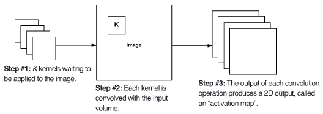
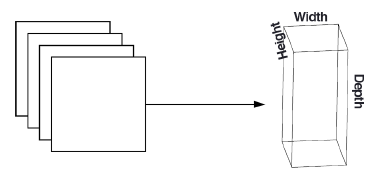

---
layout: post  
mathjax: true  
comments: true  
title: Convolutional Neural Networks  
tags: [Computer Vision]  
---  

What is a Convolutional Neural Network?  

I recently took a Computer Vision class (2019) as one of my electives in my graduate program at Northwestern University, and I found it to be the most beneficial class in the entire program from an applied perspective. The class was a little light on theory, but it more than made up for it with it's focus on utilizing cloud computing and IoT devices to bring inference to the edge. I've done a fair amount of reading in the last few months about Convolutional Neural Networks (CNNs), but I've been looking for a way to start consolidating my knowledge so that I can recall it and reference it later as the need arises.  

The main book that I've been reading (and the one referenced repeatedly in this write-up) is [Deep Learning for Computer Vision with Python](https://www.pyimagesearch.com/deep-learning-computer-vision-python-book/) by [Adrian Rosebrock](https://www.linkedin.com/in/adrian-rosebrock-59b8732a/). Adrian is a leader in the Computer Vision space, and he regularly puts out outstanding content (tutorials, books, etc.) on the topic. The book is very approachable and is packed full of knowledge.  

With that being said, the path through this post will be a condensed version of Chapter 11. Convolutional Neural Networks, for those of you that have the book, and I'll cover:  

* What are Convolutions?  
* What are Kernels?  
* What are the Layer Types in a CNN?  
* Rules of Thumb for Building CNNs  

## What are Convolutions?  
The term "Convolution" is right in the name of the neural network architecture people use for computer vision problems, but it seems some don't necessarily understand what this actually is. An image convolution can loosely be defined as an **element-wise multiplication of two matrices followed by a sum** (Rosebrock, 2017, pp. 171). For those of you that are familiar with any sort of image processing, it will come as no surprise that images are just multidimensional matrices. Color images have a depth of 3 (a layer each for RGB), and Grayscale images have a depth of 1 (all pixels are on the same color scale). In the context of CNNs, there is a smaller matrix called the kernel that slides left-to-right and top-to-bottom across the image matrix and convolves at each location. This leads us to Kernels which are designed to perform various image processing functions. There are many filters (kernels) that have been defined by hand, and we'll get to those next, but the goal of the CNN is to learn these filters automatically. Below is Figure 11.1 (Rosebrock, 2017) from the book, and it does a good job representing the kernel sliding across the image.  

  

## What are Kernels?  
Kernels (or filters) are small square matrices that slide across the image matrix, convolving at each step. What does this really mean? If we reference the image above, we have a small square matrix with pre-specified values that just element-wise multiplication with the image pixel values, then takes the sum. This single sum (i.e. the output value) is stored at the same coordinates as the center of the kernel. The goal of the kernel is to reduce the spatial dimensions of the image and perform some image processing task. Kernels always are an odd sized square matrix so that there is a clear center value (i.e. $3x3$ or $5x5$). Below is a simple example from the book regarding how a kernel slides across the image matrix and performs the convolution. This involves a $3x3$ kernel used for blurring.  

$$
O_{i,j}=\frac{1}{9}* \begin{bmatrix}
1&1&1\\
1&1&1\\
1&1&1\\
\end{bmatrix} * \begin{bmatrix}
93&139&101\\
26&252&196\\
135&230&18\\
\end{bmatrix}
$$  

This results in the following matrix after the element-wise multiplication. We can then take the sum.  

$$
O_{i,j}=\sum \begin{bmatrix}
10.3&15.4&11.2\\
2.8&28.0&21.7\\
15.0&25.5&2.0\\
\end{bmatrix}\approx 132
$$

There are several common kernels that are used for different processing tasks:  

1. Blurring  
2. Sharpen  
3. Laplacian (detect edge-like regions)  
4. Sobel (detect edge-like regions along both x and y axis)  
5. Emboss  

Below is Figure 11.5 from the book that demonstrates the effect these filters have on an image.  

  

Unlike traditional fully-connected standard neural networks, the layers of a CNN are arranged in a 3-dimensional volume (width, height, depth). Depth refers to the channels mentioned above (Grayscale vs RBG) (Rosebrock, 2017, pp. 181). The benefit to this design is that the neurons are only connected to a small region of the layer before it. This is referred to as local connectivity, and it drastically reduces the number of parameters in our network.  

## What are the Layers in a CNN?  
The most common layers used in Convolutional Neural Networks are:  

1. Convolutional  
2. Activation  
3. Pooling  
4. Fully-connected  
5. Batch Normalization  
6. Dropout  

The arrangement of these layers in a specific way results in a CNN.  

### Convolutional Layers  
Convolutional layers consist of $K$ learnable filters (i.e. kernels). These filters are responsible for creating activation maps as they slide across the image matrix. Below is Figure 11.6 from the book, and it displays this concept. Each kernel is convolved with the input and generates a 2D output called the activation map.  

  

After all $K$ filters have been applied to the input, we then stack the activation maps along the depth dimension of our array to form the final output (image below: Figure 11.7).  

  

Ever entry in the output volume is an output of a neuron that looks at only a small region of the input (Rosebrock, 2017, pp. 182). The network learns filters (kernels) that activate when they see a specific type of feature at a given spatial location. This makes sense if we think back to what a kernel does. This could mean that we've detected an edge or perhaps corner-like regions. This concept relates back to the idea of local connectivity whereby a small filter convolves with a larger input volume. This local region of the input volume that our neuron is connecting to is known as the receptive field (or variable $F$). This can be better illustrated by the example on page 183 (Rosebrock, 2017). Imagine we have an input size of $32x32x3$. If our receptive field is $3x3$, then each neuron in the convolutional layer will connect to a $3x3$ local region of the image resulting in $3x3x3=27$ weights.  

There are three separate parameters that control the size of an output volume:  

1. Depth  
2. Stride  
3. Zero-Padding  

#### Depth  
Depth is simple the number of filters we are learning in the current layer.  

#### Stride  
Stride refers to the number of pixels we slide the kernel over the input volume. The typical number is 1 or 2 ($S=1$ or $S=2). A stride of 1 results in overlapping receptive fields as the same pixels are convolved multiple times. These also result in larger output volumes. When $S=2$, we skip two pixels at a time resulting in a smaller output volume and non-overlapping receptive fields. Changing the stride of the kernel is a way to reduce the spatial dimensions of the input volumes. Along with pooling, this is the main way to perform this reduction.  

### Zero-Padding  
Padding the borders of an input volume can/will result in the output volume maintaining the original image size. The most common way of performing this is padding the outside of the matrix with zeros (hence the name). The parameter used for this padding is $P$. Padding becomes very important when we start examining deep CNN architectures where multiple convolutional filters are stacked on top of each other (Rosebrock, 2017, pp. 184). Below is a good example of what this process actually looks like. We are convolving a Laplacian kernel with an input image, but we pad the outside with zeros first so that the resulting output volume matches the original input volume (allows us to preserve spatial dimensions).  

## References  
Rosebrock, A. (2017). Deep Learning for Computer Vision with Python (1.1.0 ed.).
