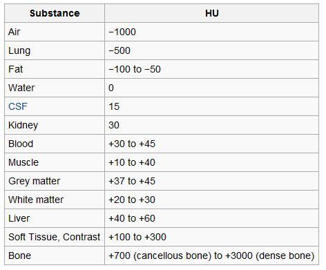
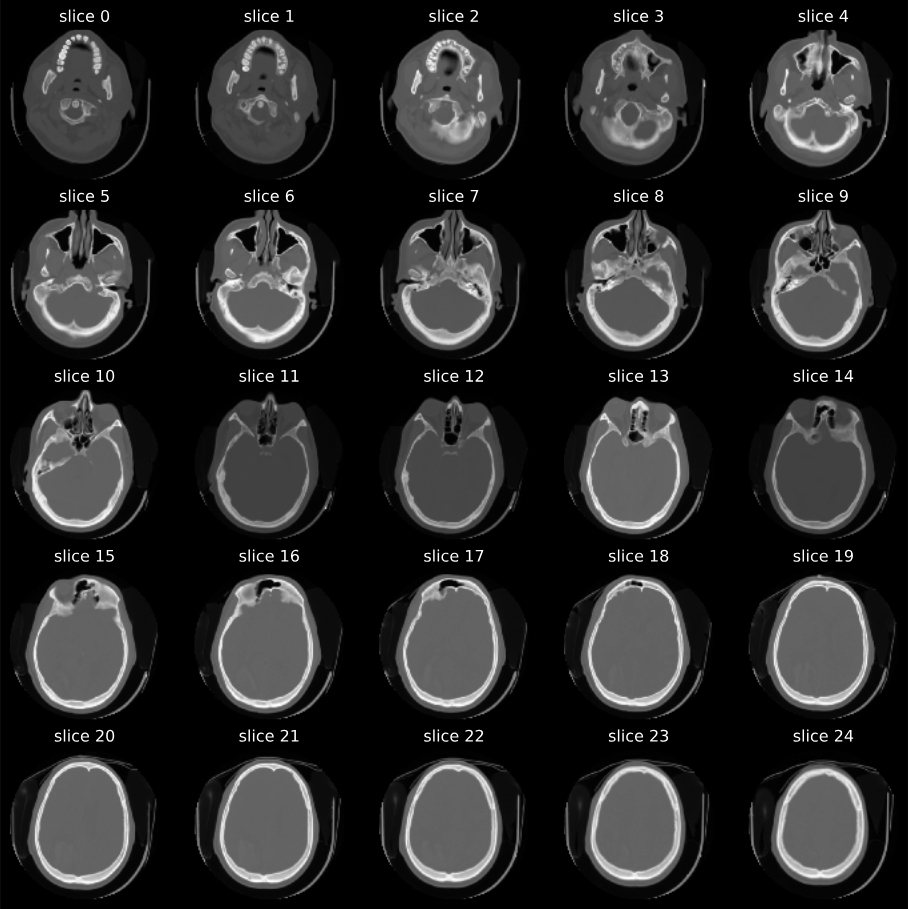
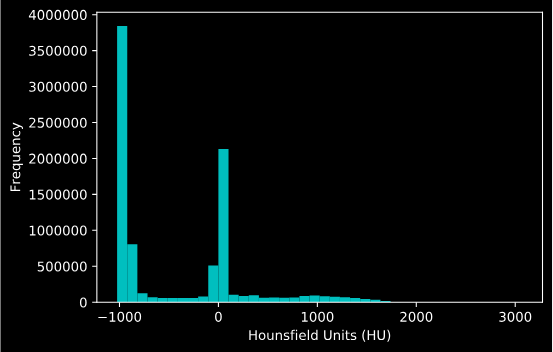

---
layout: post  
mathjax: true  
comments: true  
title: DICOM Processing  
tags: [Computer Vision]  
---  
What is the DICOM file format and how does it relate to computer vision?  

A little while ago I decided to undertake a computer vision project to detect abnormalities in brain CT scans by utilizing 3-dimensional [convolutional neural networks](https://jason-adam.github.io/convolutions/). Admittedly, this was a little more ambitious than I had time for, but it was a great learnring experience, and it forced me to work on my pre-processing skills due to the nature of the file formats that certain medical images come in. This leads me to the DICOM file format for medical imaging.   
## What is a DICOM file?  

[DICOM](https://en.wikipedia.org/wiki/DICOM) stands *Digital Imaging and Communications in Medicine*, and is considered the standard for communication and management of medical imaging information and related data. The most common usage for DICOM is to store and transmit medical images.  

Now that we have a very cursory understanding of what DICOM is and what it's used for, lets start on our pre-processing pipeline for these medical images.  

## Imports


```python
import os
from collections import Counter
from typing import List, Tuple

import numpy as np
import pydicom
import scipy.ndimage

%load_ext blackcellmagic
```

    The blackcellmagic extension is already loaded. To reload it, use:
      %reload_ext blackcellmagic


```python
# GLOBAL VARIABLES
INPUT_FOLDER = "../imgs/2020-01-12-dicom/sample_dicom/Unknown Study/"
```

## Obtaining the Data  
Before jumping into the code, I want to take a quick step back. The original study where I obtained the data can be found [here](http://headctstudy.qure.ai/#dataset). The original study predicted multiple labels for the patient (i.e. intracranial hemorrhage, fracture, midline shifts, etc.), but for the simplification of my project, I selected the abnormality affecting the most scans in the sample dataset I downloaded (Intracranial Hemorrhage).  

Below is a simple way to download one zip folder for a patient with their scans. If you want to download all the zip folders, I recommend giving yourself some time, as there are almost 500 zip files, each containing a full set (sometimes multiple sets) of scans for a patient. The total size of all patients downloaded and unzipped is roughly 40-50GB.
!wget https://s3.ap-south-1.amazonaws.com/qure.headct.study/CQ500-CT-108.zip
After the scans have downloaded, we can use the following code to see which size of scans (number of slices is the most prominent (they come in various slices). The function simply loops through our scan folders and counts up the amount of slices into a list of tuples using the `Counter` object.


```python
def most_common_slice_count() -> List[Tuple]:
    slice_counts: list = []
    list_scans = os.listdir(INPUT_FOLDER)

    for scan_folders in list_scans:
        slice_path = os.path.join(INPUT_FOLDER, scan_folders + "/")
        slices = os.listdir(slice_path)
        slice_counts.append(len(slices))

    counts = Counter(slice_counts)
    return counts.most_common(1)


print(most_common_slice_count())
```

    [(256, 1)]


## Building the Pipeline  
For this example, we only have one patient, and their folder contains a set of 256 slices. The next function using the `pydicom` library which was created for dealing with DICOM image files. The code takes in an argument for the size of slices to retrieve (256 in our case). This is a generator function which means that it returns an iterator. If you're unfamiliar with the concept, there is a great guide [here](https://realpython.com/introduction-to-python-generators/). The code reads in all the scans using the `pydicom.read_file` function and loads them to a list.


```python
def get_loaded_scans(base_path: str, slice_count: int):
    list_scans = os.listdir(INPUT_FOLDER)

    for scan_folders in list_scans:
        slice_path = os.path.join(INPUT_FOLDER, scan_folders + "/")
        slices = os.listdir(slice_path)
        if len(slices) != slice_count:
            continue
        else:
            slices.sort()
            yield list(
                [pydicom.read_file(os.path.join(slice_path, s)) for s in slices]
            )
```

We can test to see if our generator function works:


```python
test_scans = get_loaded_scans(INPUT_FOLDER, slice_count=256)

for scan in test_scans:
    print(len(scan))
```

    256


We can see that we did yield a list of slices totaling 239! It looks like our generator function is working as intended. Before we look at the next function, there is some additional information regarding CT scans that is relevant. The pixels in a CT scan are represented in [Hounsfield Units](https://en.wikipedia.org/wiki/Hounsfield_scale). The Hounsfield scale is a quantitative scale for describing radiodensity, and the value ranges represent different types of tissue. Below is an image of the value ranges for context.  

  

Prior to looking at any scans, we can guess that we'll see several of these ranges, including bone, grey matter, etc.  

Now that we have our intial generator function setup, I'm going to show what's actually in a DICOM file prior to skipping to extracting the pixels. Let's read in one for our example.


```python
sample_slice = pydicom.read_file(
    "../imgs/2020-01-12-dicom/sample_dicom/Unknown Study/CT 0.625mm/CT000082.dcm"
)

print(sample_slice)
```

    (0008, 0000) Group Length                        UL: 332
    (0008, 0005) Specific Character Set              CS: 'ISO_IR 100'
    (0008, 0008) Image Type                          CS: ['ORIGINAL', 'PRIMARY', 'AXIAL']
    (0008, 0012) Instance Creation Date              DA: ''
    (0008, 0013) Instance Creation Time              TM: ''
    (0008, 0016) SOP Class UID                       UI: CT Image Storage
    (0008, 0018) SOP Instance UID                    UI: 1.2.276.0.7230010.3.1.4.296485376.1.1521714554.2077463
    (0008, 0020) Study Date                          DA: ''
    (0008, 0023) Content Date                        DA: ''
    (0008, 0030) Study Time                          TM: ''
    (0008, 0033) Content Time                        TM: ''
    (0008, 0050) Accession Number                    SH: ''
    (0008, 0060) Modality                            CS: 'CT'
    (0008, 0070) Manufacturer                        LO: ''
    (0008, 0090) Referring Physician's Name          PN: ''
    (0008, 103e) Series Description                  LO: '0.625mm'
    (0008, 1090) Manufacturer's Model Name           LO: ''
    (0008, 9215)  Derivation Code Sequence   1 item(s) ---- 
       (0008, 0000) Group Length                        UL: 54
       (0008, 0100) Code Value                          SH: '121327'
       (0008, 0102) Coding Scheme Designator            SH: 'DCM'
       (0008, 0104) Code Meaning                        LO: 'Full fidelity image'
       ---------
    (0010, 0000) Group Length                        UL: 56
    (0010, 0010) Patient's Name                      PN: 'CQ500-CT-108'
    (0010, 0020) Patient ID                          LO: 'CQ500-CT-108'
    (0010, 0030) Patient's Birth Date                DA: ''
    (0010, 0040) Patient's Sex                       CS: ''
    (0012, 0062) Patient Identity Removed            CS: 'YES'
    (0018, 0000) Group Length                        UL: 358
    (0018, 0022) Scan Options                        CS: 'AXIAL MODE'
    (0018, 0050) Slice Thickness                     DS: "0.625"
    (0018, 0060) KVP                                 DS: "120.0"
    (0018, 0088) Spacing Between Slices              DS: "21.893"
    (0018, 0090) Data Collection Diameter            DS: "320.0"
    (0018, 1020) Software Versions                   LO: 'gmp_vct.42'
    (0018, 1100) Reconstruction Diameter             DS: "254.0"
    (0018, 1110) Distance Source to Detector         DS: "949.147"
    (0018, 1111) Distance Source to Patient          DS: "541.0"
    (0018, 1120) Gantry/Detector Tilt                DS: "24.0"
    (0018, 1130) Table Height                        DS: "170.0"
    (0018, 1140) Rotation Direction                  CS: 'CW'
    (0018, 1150) Exposure Time                       IS: "2000"
    (0018, 1151) X-Ray Tube Current                  IS: "350"
    (0018, 1152) Exposure                            IS: "21"
    (0018, 1160) Filter Type                         SH: 'MEDIUM FILTER'
    (0018, 1170) Generator Power                     IS: "42000"
    (0018, 1190) Focal Spot(s)                       DS: "1.2"
    (0018, 1210) Convolution Kernel                  SH: 'SOFT'
    (0018, 5100) Patient Position                    CS: 'HFS'
    (0018, 9305) Revolution Time                     FD: 2.0
    (0018, 9306) Single Collimation Width            FD: 0.625
    (0018, 9307) Total Collimation Width             FD: 20.0
    (0020, 0000) Group Length                        UL: 282
    (0020, 000d) Study Instance UID                  UI: 1.2.276.0.7230010.3.1.2.296485376.1.1521714553.2077229
    (0020, 000e) Series Instance UID                 UI: 1.2.276.0.7230010.3.1.3.296485376.1.1521714553.2077298
    (0020, 0010) Study ID                            SH: ''
    (0020, 0011) Series Number                       IS: "3"
    (0020, 0012) Acquisition Number                  IS: "6"
    (0020, 0013) Instance Number                     IS: "188"
    (0020, 0032) Image Position (Patient)            DS: [-127.000, -109.320, 89.965]
    (0020, 0037) Image Orientation (Patient)         DS: [1.000000, 0.000000, 0.000000, 0.000000, 0.913545, -0.406737]
    (0020, 1040) Position Reference Indicator        LO: 'OM'
    (0020, 1041) Slice Location                      DS: "41.292"
    (0028, 0000) Group Length                        UL: 184
    (0028, 0002) Samples per Pixel                   US: 1
    (0028, 0004) Photometric Interpretation          CS: 'MONOCHROME2'
    (0028, 0010) Rows                                US: 512
    (0028, 0011) Columns                             US: 512
    (0028, 0030) Pixel Spacing                       DS: [0.496094, 0.496094]
    (0028, 0100) Bits Allocated                      US: 16
    (0028, 0101) Bits Stored                         US: 16
    (0028, 0102) High Bit                            US: 15
    (0028, 0103) Pixel Representation                US: 1
    (0028, 0120) Pixel Padding Value                 SS: -2000
    (0028, 1050) Window Center                       DS: "350.0"
    (0028, 1051) Window Width                        DS: "2000.0"
    (0028, 1052) Rescale Intercept                   DS: "-1024.0"
    (0028, 1053) Rescale Slope                       DS: "1.0"
    (0028, 1054) Rescale Type                        LO: 'HU'
    (0040, 0000) Group Length                        UL: 12
    (0040, 0009) Scheduled Procedure Step ID         SH: 'ANON'
    (7fe0, 0010) Pixel Data                          OW: Array of 524288 elements


We can see that the DICOM slice contains very rich metadata about the patient and the slice itself. The final element in the slice contains an array of elements. These are our pixels.  

The following function was adapted and modified from [here](https://www.kaggle.com/saptarc/processing-lungs-ct-scans). It stacks all scans into a 3D numpy array, adjusts pixels based on a padding value, and converts to hounsfield units. The results is a transformed 3D numpy array. Since this function accepts a list (an iterator), we can pass the output of our previous function to it. This function also is a generator (it returns an iterator). We can begin to see why they are so powerful for preprocessing pipelines. The resultant iterator is only loaded into memory one at a time instead of the entire batch. This makes these pipelines extremely fast and memory efficient.


```python
def get_pixels_hu(slices: list):
    for scans in slices:
        try:
            patient_id = str(scans[0].PatientName)
            image = np.stack([s.pixel_array for s in scans])
            image = image.astype(np.float)

            # Set outside-of-scan pixels to 0
            image[image == -2000] = 0

            # Convert to Hounsfield units (HU)
            for slice_number in range(len(scans)):

                intercept = scans[slice_number].RescaleIntercept
                slope = scans[slice_number].RescaleSlope

                if slope != 1:
                    image[slice_number] = slope * image[slice_number]

                image[slice_number] += np.float(intercept)

            yield np.array(image, dtype=np.float), patient_id
        except:
            pass
```

Now I know it's not good practice to just generically pass on exceptions, but for the sake of the assignment I wasn't too concerned if a sample didn't load for some reason. This would be a place where it would be a nice touch to refactor this to handle any pre-processing errors.

Our final function in the pipleine is a normalization function.


```python
def normalize_stacks(image, min_bound=-1000.0, max_bound=2000.0):
    image = (image - min_bound) / (max_bound - min_bound)
    image[image > 1] = 1
    image[image < 0] = 0
    return image
```

Below is a simple sample of our total pipeline that was in the main function. I left out the part about saving the numpy array to a separate file to avoid having to constantly re-run the pipeline.


```python
test_scans = get_loaded_scans(INPUT_FOLDER, slice_count=256)
scan_array = get_pixels_hu(test_scans)

for i, j in scan_array:
    normalized = scipy.ndimage.interpolation.zoom(i, (1, 0.50, 0.50), mode="nearest")
    normalized = normalize_stacks(normalized)
    normalized = normalized - np.mean(normalized)
    print(normalized.shape, j)
```

    (256, 256, 256) CQ500-CT-108


It looks like our pipeline has created our 3D numpy array, and we can use the patient id to label the file save!  

Now that we've stepped through a basic pre-processing pipeline for DICOM files, let's visualize some slices.  

## Visualization  
Below is a sample grid of scans that I generated when working on the project. It's a really cool feeling to see them come to life on the screen. 

  

Circling back to the Hounsfield units, here is a histogram I generated with the values. We can clearly see some of the tissue types coming through based on our table earlier.  

  

## Summary  
DICOM files are a universal way for storing medical images. Hopefully this tutorial can serve as a starting point for processing these files for further use. The continuation of this projet involved building a 3D convolutional neural network that almost melted my Macbook Pro. The full repo can be found [here](https://github.com/Jason-Adam/cv-medical).  
